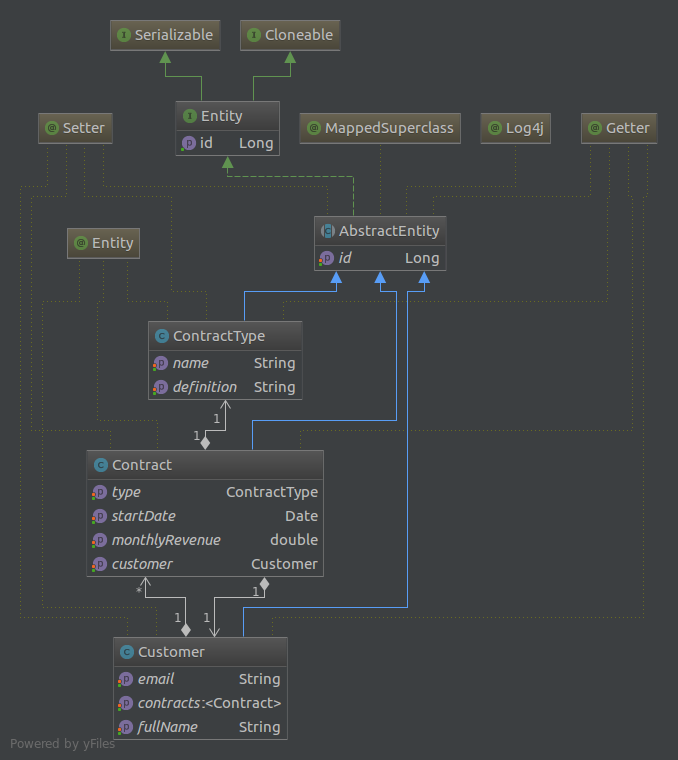
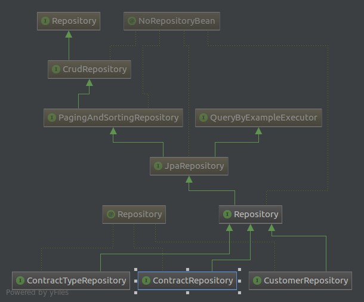
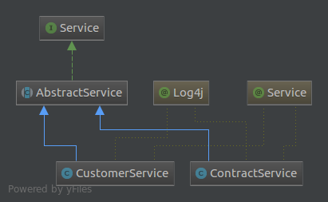

# RESTful Customer Web Service

[](https://travis-ci.org/OnurKaraduman/customer-service)


This is a sample of a customer-service RESTful Web Service based on Spring Boot platform using MySQL DB as a persistent storage.

**Warnings**
1. The project doesn't have authentication system.
1. Controllers doesn't have unit tests (I had some trouble with spring mockmvc).


### Technology stack
* [Spring Boot](http://projects.spring.io/spring-boot/)
* [Spring JPA Data](http://projects.spring.io/spring-data-jpa/)
* Spring Jersey
* [Spring HATEOAS](http://projects.spring.io/spring-hateoas/)
* [Embedded Jetty](https://www.eclipse.org/jetty/)
* [MySQL](https://www.mysql.com/)
* [Lombok](https://projectlombok.org/)
* [Swagger](http://swagger.io/)
* [AssertJ](http://joel-costigliola.github.io/assertj/)
* [Dozer](http://dozer.sourceforge.net/documentation/usage.html)
 

### Software Design Overview

#### Data Structure
 
 The following screenshot shows the data structure:
 
 
 
#### Data Access Layer
  
  The following screenshot shows the Data Access Layer UML class diagram:
  
  
 
#### Business Layer
 
 The following screenshot shows the Business Layer UML class diagram:
 
 
 
 
### Building

##### Using Maven

````sh
mvn clean install
````

### Running 

Before running, you should create database in mysql:

````
create database customer_service;
````

##### Using Maven
Currently, there are two different environment profiles (prod, test). But the configurations are same in both file.


With Production environment

````sh
mvn spring-boot:run -Dspring.profiles.active=prod
`````

With Test environment

````sh
mvn spring-boot:run -Dspring.profiles.active=test
`````

### Packaging

##### Using Maven

```` sh
mvn package
````

### Usage

For testing purposes curl is used.

##### Let's start with **ROOT** API resource.

The REST service strongly **Hypermedia-driven** and Content Type is **application/hal+json**.

````sh
curl -X GET http://localhost:8080/api/v1.0.0/ -k
````

You will received hal+json.
````json
{
    "_links": {
        "customers": {
            "href": "http://localhost:8080/api/v1.0.0/customers"
        }
    }
}
````
##### Add a new customer

````sh
curl -X POST http://localhost:8080/api/v1.0.0/customers -k -d '{ "fullName":"John Doe", "email":"john@tmail.com" }' -H 'Content-Type: application/json'
````

You will receive success message.
:TODO Maybe we can return the customer with ID instead of success message
````json
{  
   "code":200,
   "message":"Success"
}
````

If customer fullName is already exist in database, you will receive following error:

````json
[  
   {  
      "logref":"error",
      "message":"Customer already exist. Customer FullName:John Doe",
      "links":[  

      ]
   }
]⏎
````


##### Add a new contract to an existing customer

````sh
curl -X POST http://localhost:8080/api/v1.0.0/customers/1/contracts -k -d '{"startDate":"2017-04-01","monthlyRevenue":"2000","type":"express"}' -H 'Content-Type: application/json'
````
You will received success message.
````json
{  
   "code":200,
   "message":"Success"
}
````

If the customer doesn't exist, you will recieve following error:
````json
[  
   {  
      "logref":"error",
      "message":"Customer not found. CustomerID:1",
      "links":[  

      ]
   }
]
````

##### Retrieve all the information about an existing customer (you've created in section above), including their contracts information

````sh
curl -X GET http://localhost:8080/api/v1.0.0/customers/1 -k -v
````

You will received following json:

````json
{  
   "fullName":"John Doe",
   "email":"john@tmail.com",
   "contracts":[  
      {  
         "startDate":1491004800000,
         "monthlyRevenue":2000.0,
         "type":null
      }
   ]
}
````

#### Retrieve the sum of revenues of all contracts from an existing customer.

````sh
curl -X GET http://localhost:8080/api/v1.0.0/customers/1/contracts/sum -k -v
````

You will receive sum of revenue.

````json
{  
   "sumRevenue":2000.0
}
````

#### Retrieve the sum of revenues of all contracts of a specific type (e.g. express contract type)

````sh
curl -X GET http://localhost:8080/api/v1.0.0/contracts/express/sum -k -v
````

You will received sum of revenue

````sh
{  
   "sumRevenue":2000.0
}
````
#### For more details about web services, you can use swagger documentation
````sh
http://localhost:8080/api/v1.0.0/swagger-ui.html
````